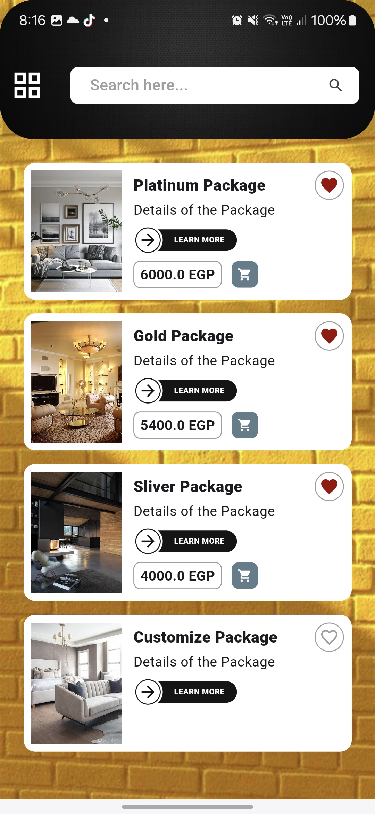
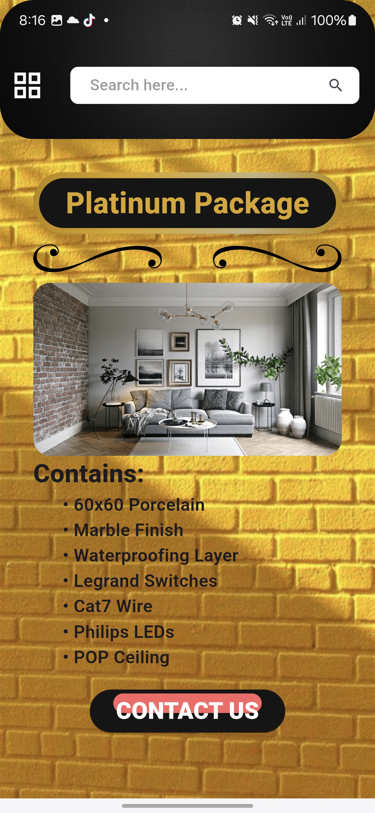

# yara_inweb_company_task

This application is developed for educational purposes.

## 📱 Getting Started
**Task:** Two Pages Ul Implementation in Flutter

**Objective:** Create a one-page IJI (which you already have) in Flutter within 24 hours, adhering to the
guidelines below. The main focus is on producing clean, maintainable code with optimized build
structures.

## 📸 Screens

  

  
